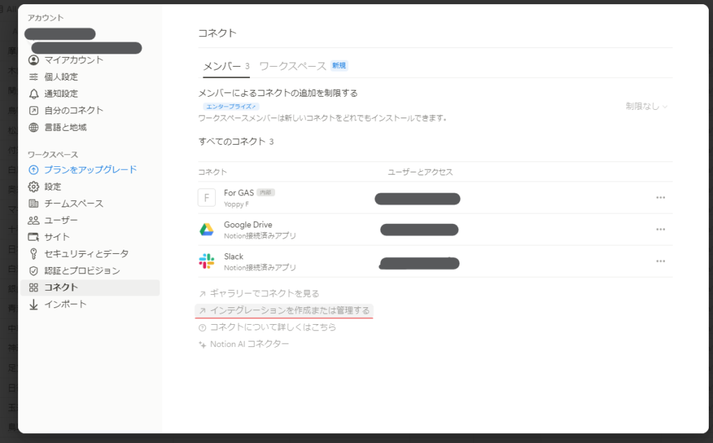
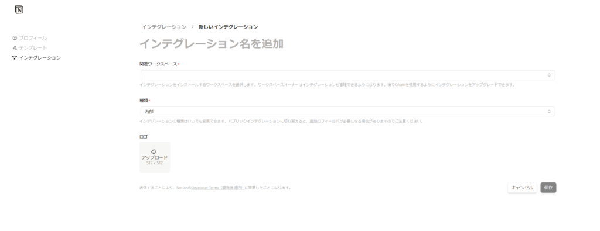
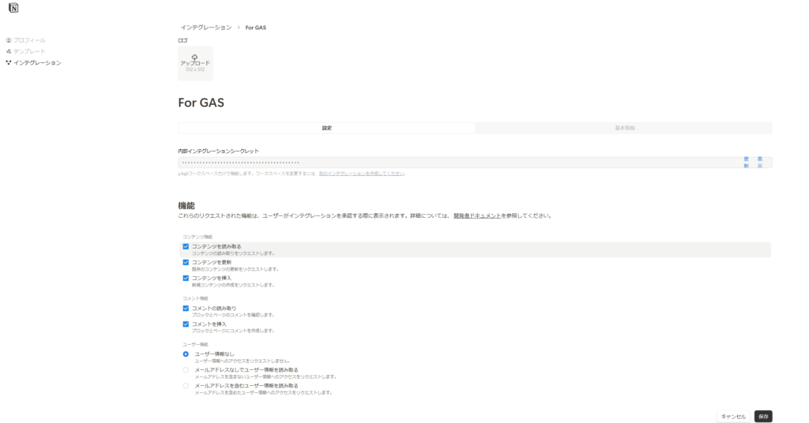
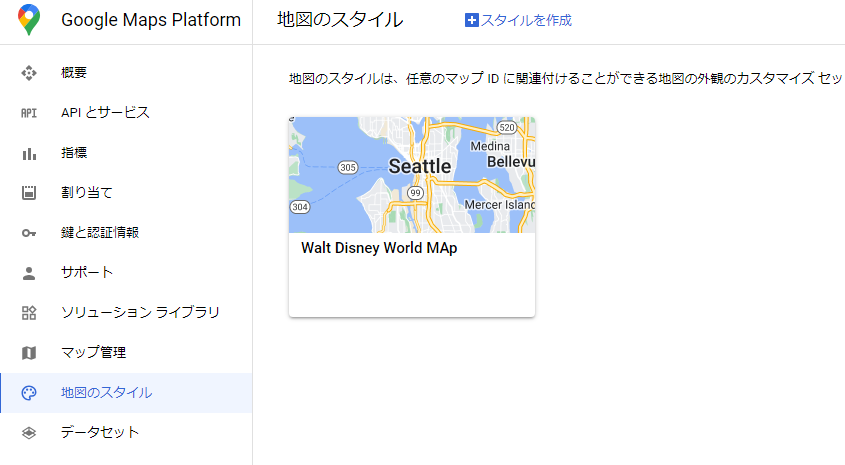
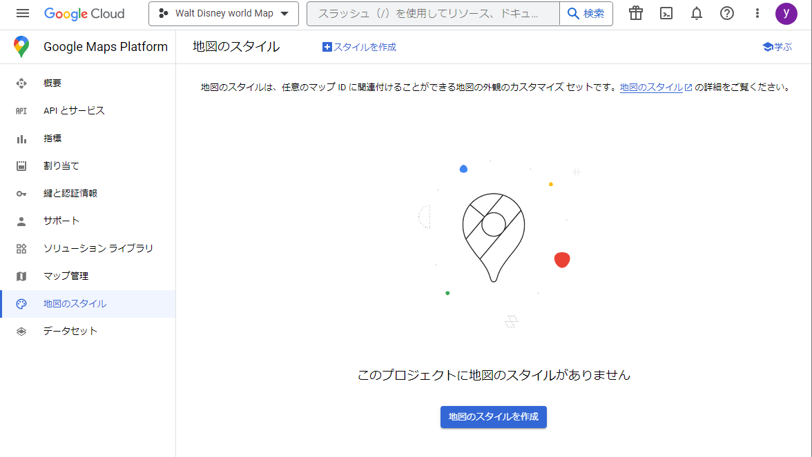
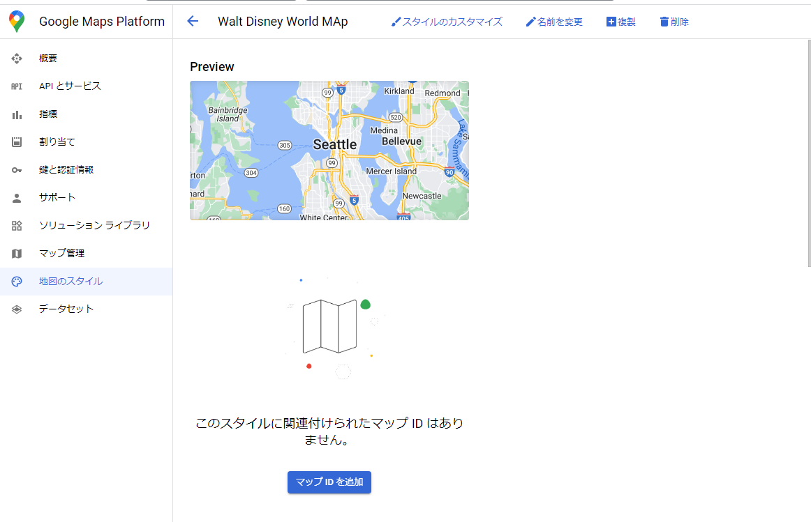

---
title: "NotionのデータベースをGASでSpreadSheetに出力する方法"
pubDate: 2024-10-06
categories: ["IT・ガジェット"]
description: ""
---

手軽さと多様なビューで便利なNotionのデータベース。しかし関数などの面でExcelやSpreadSheetなどの表計算ソフトには劣ってしまいます。  
そこでNotionのデータベースをSpreadSheetに出力する方法をご紹介します。

## Notion→Google SpreadSheetを実現する三つの方法

NotionからSpreadSheetにデータベース出力する方法は3つあります

- CSVにExportする

- 有料アドオンを使用する

- **自分でプログラミングする**

このなかでも今回はプログラミングする方法に絞って解説します。

ちなみに、プログラミングに自身のない人には、有料アドオン「[Sync2Sheets](https://www.notion.so/ja/integrations/sync2sheets)」がおすすめです

## GASでNotion→Google SpreadSheetする方法

### 1.Notion APIが使用できる状態にする

NotionAPIとはNotionのページやデータベースを自動で「読み込み・追加・更新・削除」するツールです。

#### 1-1.インテグレーションを作成する

Notionの設定からを「コネクト > インテグレーションを作成または管理する」を選択します。

または、このリンク「[https://www.notion.so/profile/integrations](https://www.notion.so/profile/integrations)」も使用できます

すると、ブラウザでNotionのインテグレーションのページが開くので、新しいインテグレーションを開きます。

「インテグレーション名」、「関連ワークスペース」、「種類」を記入し、保存を押下します。  
個人利用が目的なので、種類は内部(internal)でよいです。

すると新しいインテグレーションが作成されます。

内部インテグレーションシークレットがいわゆるAPIKeyと言われているものです。  
APIKeyとは、プログラムのための合鍵のようなもので、これが一致する場合のみNotionはAPIでの操作を受け付けます。なので他人に知られることのないようにしましょう。

機能の「コンテンツ機能」・「コメント機能」はすべて有効にしておくと後で困らないと思います。  
仕事仲間や家族と共有する場合は適切に制限をかけてください。

「ユーザー機能」は情報なしで困らないと思います。

#### 1-2.データベース・ページにインテグレーションを適応する

次に作成したインテグレーションをデータベースやページに適応します

適応したいページ・データベースを開き右上の設定から、「コネクト > 接続先」を選択します。  
コネクトを探すの検索ボックスに先ほど作成したインテグレーション名を入力し、選択します。

すると以下のようなダイアログが表示されるので、「はい」を選択し続行します。

次のように表示されていれば成功です。

### 2.SpreadSheetにAppScriptを追加する
